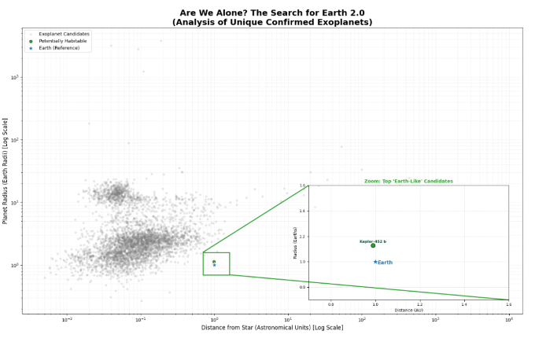

# Are We Alone? The Search for Earth 2.0 🌍
> **Author:** Tanishq Dahiya
> **Module:** CSC1143/CSC1175 Data Visualisation

## 📖 Overview

  

This project tackles one of the most profound questions in astronomy: *"Are we alone?"*. Using the **NASA Exoplanet Archive dataset**, we analyzed the physical characteristics of thousands of exoplanets to determine the rarity of "Earth-like" worlds compared to uninhabitable gas giants.

The core of this project is a data visualization that maps planetary radius against orbital distance, highlighting a distinct "Goldilocks Zone" of potential habitability.

## 📊 Key Features & Analysis
- **Dataset:** Nasa's Exoplanet Dataset ( NASA Exoplanet Archive (NEA))  (DOI) 10.26133/NEA12 
- **Data Cleaning:** Processed raw NASA data using **Pandas**, handling missing values and filtering for relevant astrophysical parameters.
- **Visualization:** Created a complex scatter plot using **Matplotlib** with the following features:
  - **Log-Scaling:** Applied to handle the vast range of planetary distances.
  - **Inset Zoom:** A specialized zoom-in window to label specific candidate planets like *Kepler-452 b* that are statistically rare.
  - **Contextual Annotations:** Used green connecting lines to link the "Earth-like" cluster to the zoom window.

## 🛠️ Tech Used
- **Language:** Python
- **Libraries:**
  - `pandas` (Data manipulation)
  - `matplotlib` (Visualization & Patches)
  - `numpy` (Numerical operations)

